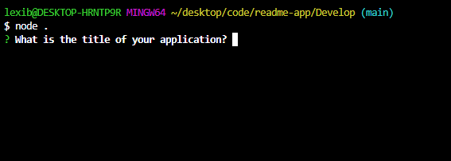

# Command Line README Generator

## Description

This project presents an entirely JavaScript-based application that allows the user to create a README file for their project through the command line.

## Table of Contents (Optional)

- [Usage](#usage)
- [Credits](#credits)
- [License](#license)

## Usage

The app operates entirely though the command line. To use it, open the index in the terminal and initialize the app with the command 
`node index.js` or 
`node .` 

Here is a video walkthrough of the application in action:

## Credits

Sections of this code were created collaboratively with several of my classmates from the EdX Full Stack Bootcamp: Alex Kaye, David Truong, and Damon Storie. The instructor Jon Lynch also provided invaluable help with the section of code to create a function to generate a license badge.

## License

Jessica Jones 2024
[Find Jessica on Github](https://www.github.com/distractabee)
Email Jessica at <jssclgh@gmail.com>

